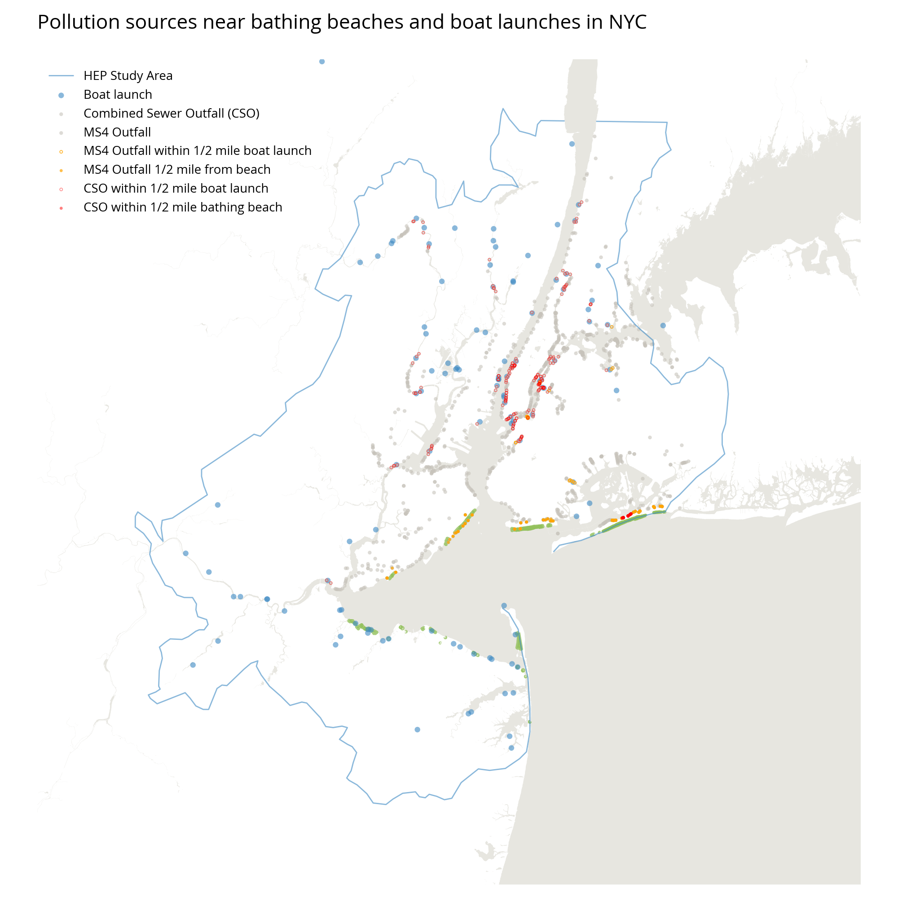

# Geospatial Data and Design Python Project

My goal for this project to create a tool or scripts to automate tasks for setting up and preparing data for geospatial data projects and to create code templates to use for processing and plotting that data. With the work flow of geospatial design projects in mind, this code is first focused on data prep and organization, and then provides templates for visual exploration.

**Data sources**
Data used for this project comes from a multi faceted design job I've been working on. The primary data source is the NY-NJ Harbor Estuary Program in New York City. Some of the data comes from the NYC Open Data Portal, and USGS. 

**Dependencies / Python libraries**
Geopandas: for working with spatial data
Matplotlib: for plotting 
Shapely: to handle geometry
Fiona: to read and write data 
Descartes: to integrate Matplotlib and Shapely

**Background**
I am creating this code set to use as a reference and template for future projects as I continue to learn Python and Geopandas. As a cartographer and designer working with data visualization, I rely heavily on QGIS, spreadsheets and design software and find myself repeating many data based processes manually.  Being able to load spatial data into python and create scripts to help with repetitive tasks can cut down on time spent organizing and preparing for projects, and it can facilitate quick exploration of the data. As I developed this code it was often difficult to find clear examples for plotting and styling different types of data with Geopandas. This repository puts code needed to run a few common GIS processes and to set a few plotting parameters in one place. I hope to add to it in the future and to improve it. 
 
 **Tasks**
- load a group of shapefiles into memory as geodataframes
- check the CRS of geodataframes and put all into the same projection
- plot geodataframes in separate plots and as small multiples 
- geoprocess for analysis: 
	- buffer
	- clip
	- join

- plot geodataframes to explore findings
	- style categorical point and polygon data
	- create and use custom palettes
- set parameters so plots can be exported in vector format for editing 
	
**Examples:** 

Create small multiple maps from a dictionary of geodataframes

Plot categorical point and polygon data

Use geoprocessing for analysis and show findings

